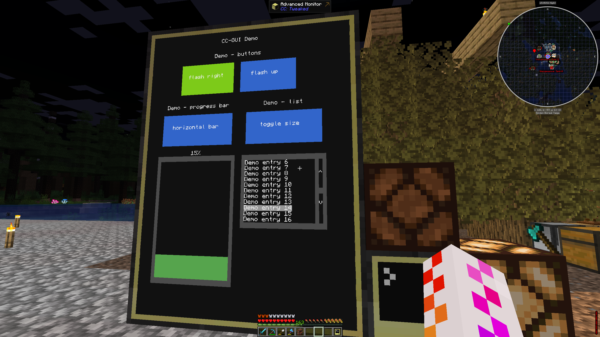

# CC-GUI
Computercraft toolkit for creating graphical user interfaces



features:
- flexible choice between integrated terminal and external monitor display: yes
- multi-monitor display: yes
- integrated event handling (i.e. click handling, etc.): yes
- widgets:
  - label: yes
  - button: yes
  - list: yes
  - progress bar: yes
  - input: yes (terminal-only)
  - textbox: planned
  - checkbox: planned
  - radio buttons: planned

## Setup
To install CC-GUI, enter this command in the CLI or download the `GUI.lua` file from the list above:
```
wget https://raw.githubusercontent.com/LD-Reborn/CC-GUI/main/GUI.lua
```

## Usage
See `demo_term.lua` for an example within the terminal.
See `demo_mon.lua` for an example with a monitor.

## FAQ
### Will over-the-network rendering become a feature?
~~This is not X11~~ Maybe...? If you have like a distributed shop system with digital signage that might be a valid use-case.
### Does the input work on a monitor too?
Not really. It reacts to touch, however you cannot type outside of the terminal. So you would need to touch the input and open the terminal. Doable, but not a real use-case